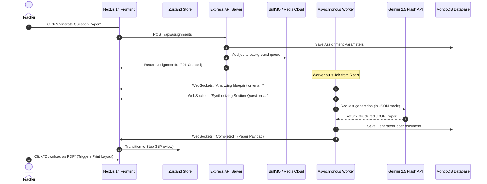

# VedaAI — AI Assessment Creator Platform

VedaAI is a full-stack, real-time examination paper creator designed for educators. It allows teachers to define custom assignment blueprints (number of questions, marks per question, topic instructions, and attachments) and leverages the Gemini API to synthesize academically rigorous, highly realistic exam papers and grading answer keys in an instant.

The entire system is optimized to operate asynchronously, streaming progress updates in real-time to the browser without blocking APIs.

---

## 🚀 Key Architectural Highlights (High-Signal for Recruiters)

Unlike basic AI prototypes, VedaAI is engineered with production-grade practices:

* **Asynchronous Task Pipeline (BullMQ + Redis)**: Heavy AI synthesis tasks are decoupled from the HTTP thread. Submitting a form dispatches a job to a background queue, letting the API respond instantly (201 Created) while background workers handle the work.
* **Real-time Telemetry (WebSockets)**: Features a live WebSocket stream using Socket.io rooms. The background BullMQ worker continuously streams milestone updates (*"Analyzing criteria..."*, *"Generating Section A..."*, *"Compiling answer keys..."*) straight to the React client's progress skeleton.
* **True AI JSON Constraints**: Leverages Gemini 2.5 Flash in native JSON mode (`responseMimeType: "application/json"`). This enforces that the LLM responds strictly within our Mongoose schema constraints—completely avoiding common raw markdown code block wrapping problems or schema mismatch crashes.
* **Polished PDF Print Layout**: Incorporates custom CSS print media stylesheets. When a teacher clicks "Download as PDF" or presses Ctrl+P, the system hides dashboard menus, strips background shadows, and reformats the exam paper as a standard, print-perfect physical A4 sheet containing student details (Name, Roll No, Section) and custom difficulty tags.
* **Preloaded Recruiter Demo Mode**: Pre-populates the dashboard with 4 distinct, highly realistic sample assignments (Midterm Physics, Advanced Calculus, Organic Chemistry, and World History). Clicking any card instantly loads the full, topic-specific A4 exam paper and model answer keys in real-time, allowing immediate evaluation without requiring API keys on setup.
* **Zustand State Management**: Managed via a clean, unified Zustand store (`src/store/useAssignmentStore.ts`), tracking tabs, active queues, log streams, and active exam states with zero boilerplate.

---

## 🛠️ Technology Stack

| Layer | Technologies Used |
| :--- | :--- |
| **Frontend** | Next.js 14, TypeScript, TailwindCSS, Ant Design, Zustand, Framer Motion, Socket.io-client |
| **Backend** | Node.js, Express, TypeScript, MongoDB, Redis, BullMQ, Socket.io |
| **AI Synthesis** | Google Gemini 2.5 Flash API (Structured JSON Mode) |

---

## 📡 System Architecture & Flow



---

## ⚙️ Environment Configuration

Set up these `.env` configuration files to connect the platform services:

### 1. Backend Environment Configuration (`backend/.env`)
Create a `.env` file in the `backend/` directory based on the provided `backend/.env.example`:

```env
PORT=5000
MONGO_URI=mongodb://localhost:27017/veda-ai
REDIS_HOST=your-redis-host-endpoint
REDIS_PORT=your-redis-port
REDIS_PASSWORD=your-redis-password
GEMINI_API_KEY=your-gemini-api-key
NODE_ENV=development
```

---

## 🚀 Running the Project Locally

Ensure you have **Node.js (v18+)**, **MongoDB**, and **Redis** running.

### Step 1: Start the Backend Server
```bash
cd backend
npm install
npm run dev
```
*The backend server will launch at `http://localhost:5000`.*

### Step 2: Start the Frontend Client
```bash
# Return to the root workspace directory
cd ..
npm install
npm run dev
```
*The frontend client will launch at `http://localhost:3001` (or `3000` depending on port availability).*

---

## 📁 Repository Directory Structure

```
c:\Veda AI Assignment\
├── src/
│   ├── app/
│   │   ├── layout.tsx          # Root layout with font definitions
│   │   ├── page.tsx            # Main dashboard with interactive routing
│   │   └── globals.css         # Stylesheets & optimized PDF print styles
│   ├── components/
│   │   ├── Sidebar.tsx         # Dashboard left navigation
│   │   ├── Navbar.tsx          # Top navigation breadcrumbs
│   │   ├── EmptyState.tsx      # Empty dashboard illustration
│   │   ├── AssignmentsList.tsx  # Grid displaying assignment cards
│   │   ├── CreateAssignmentWizard.tsx # Form creation step-wizard
│   │   ├── QuestionPaperView.tsx # Printable A4 sheet preview
│   │   ├── ExamSection.tsx     # Question section renderer
│   │   ├── QuestionItem.tsx    # Single question component
│   │   ├── DifficultyBadge.tsx # Custom visual difficulty badges
│   │   └── LoadingSkeleton.tsx # Simulated skeleton & websocket telemetry loader
│   ├── store/
│   │   └── useAssignmentStore.ts # Central Zustand state store
│   ├── services/
│   │   └── api.ts              # REST API Fetch service layer
│   ├── hooks/
│   │   └── useAssignmentSocket.ts # WebSocket socket.io hook
│   └── types/
│       └── index.ts            # Shareable TypeScript models
├── backend/
│   ├── src/
│   │   ├── index.ts            # Server entry point
│   │   ├── app.ts              # Express configuration
│   │   ├── config/
│   │   │   ├── database.ts     # MongoDB connection setup
│   │   │   └── redis.ts        # Redis client configurations
│   │   ├── models/
│   │   │   ├── assignment.model.ts
│   │   │   └── generatedPaper.model.ts
│   │   ├── queues/
│   │   │   └── generation.queue.ts # BullMQ Queue dispatcher
│   │   ├── workers/
│   │   │   └── generation.worker.ts # BullMQ Background job processor
│   │   ├── sockets/
│   │   │   └── socket.handler.ts   # WebSockets socket routing
│   │   └── utils/
│   │       ├── aiService.ts        # Gemini 2.5 Flash Service Layer
│   │       └── mockGenerator.ts    # Stable diagnostic mock fallback
│   ├── .env.example
│   └── package.json
└── package.json
```
